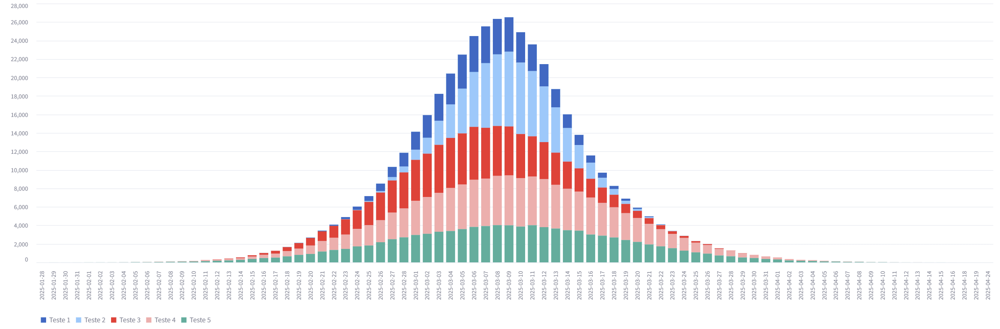

## Simulador de Janela de Polinização

Este simulador foi desenvolvido para ajudar a idealizar cenários de grupos de plantas com diferentes datas de plantio para redução de grandes picos de polinização, o que pode ser útil para a planejamento de mão-de-obra e equipamentos.

### Como funciona?

1. Adicione um grupo de plantas com as seguintes informações:
   - Nome do grupo de plantas
   - Data de plantio
   - Total de plantas
   - Média de dias para florescimento
   - Desvio padrão de dias para florescimento
   - Média de flores por planta
   - Desvio padrão de flores por planta
2. Clique em "Adicionar" para adicionar o grupo de plantas.
3. Repita o passo 1 para adicionar mais grupos de plantas.
4. Clique em "Gerar simulação de janela de polinização" para visualizar a simulação.

### Como tudo é calculado?

1. Para cada planta, o número de flores é calculado usando uma distribuição normal com a média e o desvio padrão fornecidos.
2. Para cada flor, o dia de florescimento é calculado usando uma distribuição normal com a média e o desvio padrão fornecidos.
3. Geramos uma lista de dias de florescimento e contamos o número de flores em cada dia.

### O que é exibido na simulação?

A simulação exibe um gráfico de barras com o número de flores em cada dia de florescimento para cada grupo de plantas adicionado.

O eixo x representa a data de florescimento e o eixo y representa o número de flores.

Com isso você pode editar as datas e analisar cada novo cenário.
